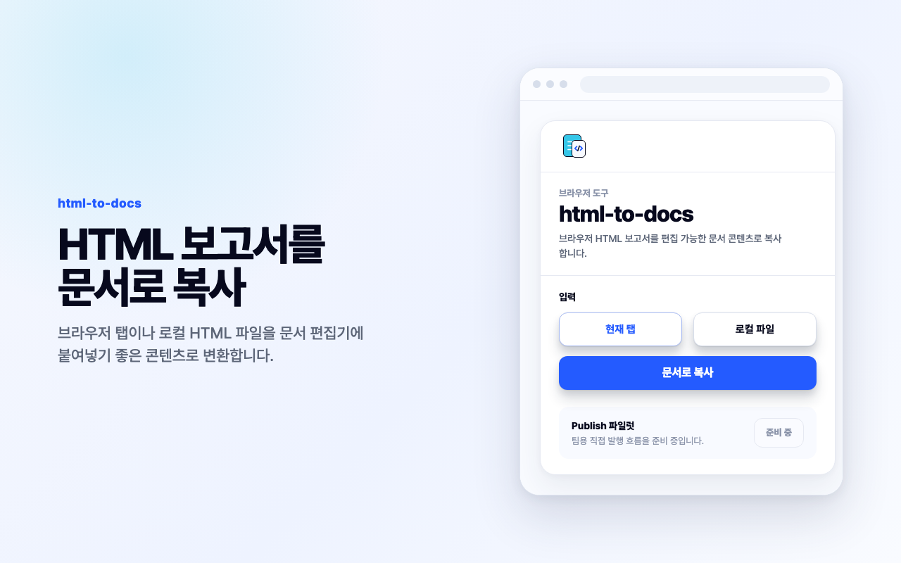
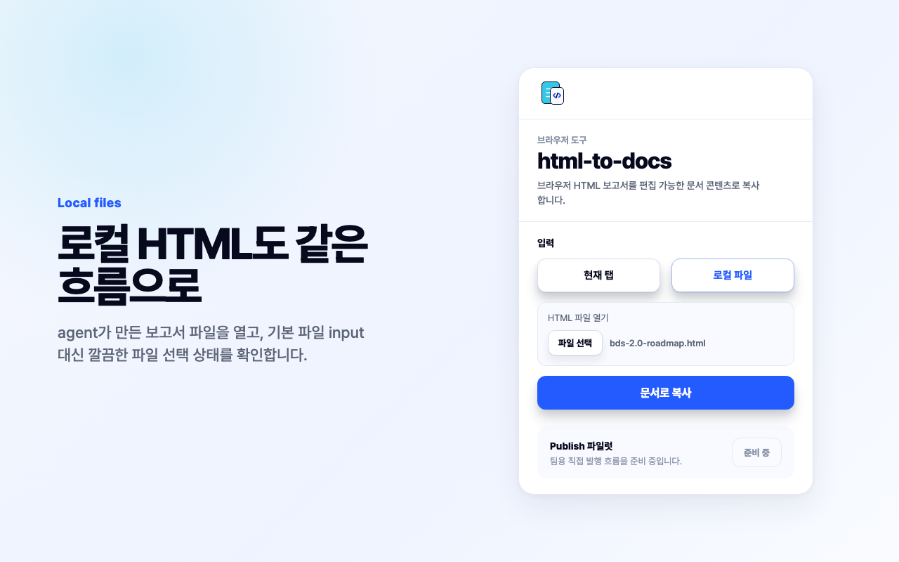
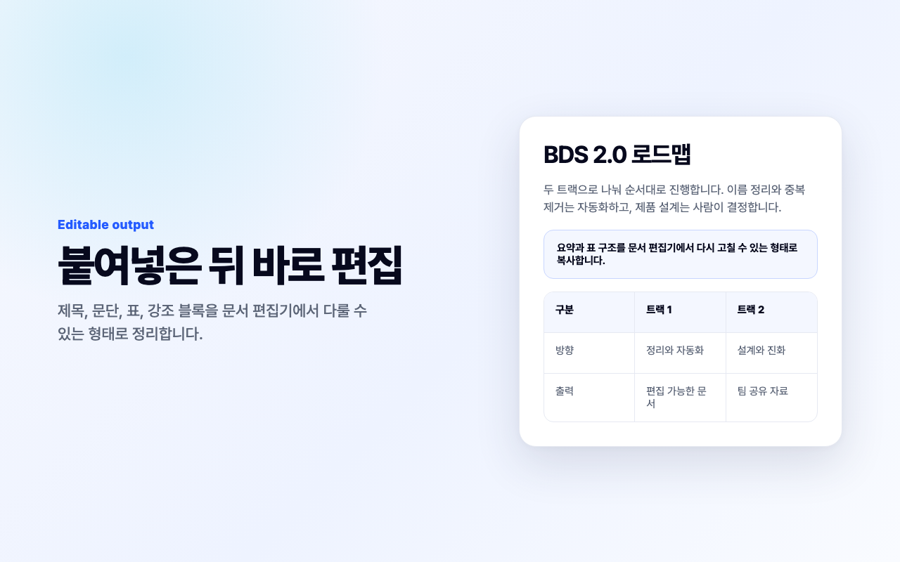

# html-to-docs

Chrome extension for copying browser or local HTML reports as editable document content.

html-to-docs is designed for reports created by AI agents, internal tools, dashboards, and local HTML exports. Open the extension, choose the current tab or a local HTML file, then copy the converted content to your clipboard.

The MVP is a free public release candidate with English and Korean UI. The popup focuses on one primary action: `Copy as document`.

## Preview







## Features

- Copy the current browser tab as document-friendly HTML.
- Open a local `.html` file and copy it through the same flow.
- Preserve useful document structure such as headings, paragraphs, lists, tables, links, and simple emphasis.
- Keep conversion local in the browser. The extension does not send page HTML to a server.
- Use a focused popup UI with no account, payment, or setup required.

## Current Limitations

- Complex CSS, scripts, interactive widgets, and highly custom layouts may be simplified by the target editor.
- Direct publishing is not enabled yet. The Publish pilot section is shown as a preparation state.

## Workspace

```text
apps/extension        Chrome Manifest V3 extension
packages/converter   HTML to docs conversion engine
packages/shared      Shared types and constants
docs/superpowers     Product design specs
```

## Chrome Web Store

The store upload package and generated graphic assets are kept under `release/` locally and ignored by git.

- Extension package: `release/html-to-docs-0.1.0.zip`
- Store assets: `release/html-to-docs-store-assets.zip`
- Listing copy and privacy fields: [`docs/chrome-web-store-listing.md`](docs/chrome-web-store-listing.md)

## Commands

```bash
npm install
npm run check
npm test
npm run build
```

After `npm run build`, load `apps/extension/dist` as an unpacked extension in Chrome.

## Privacy

The extension processes page HTML locally in the browser. It uses `activeTab` and `scripting` only after the user clicks the copy action, and `clipboardWrite` to write the converted document content to the user's clipboard.
